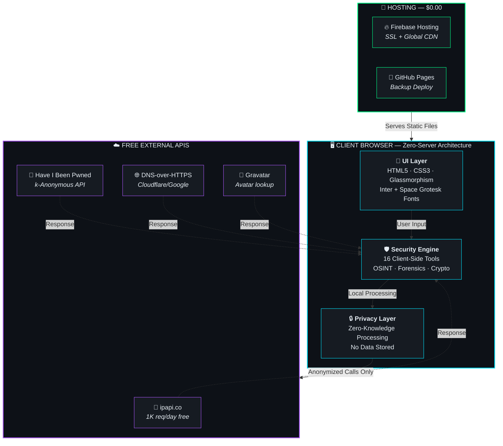
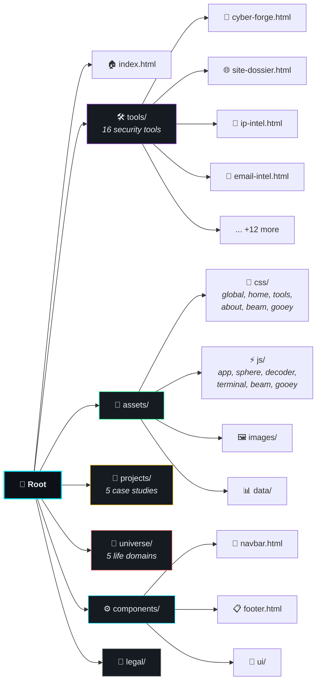
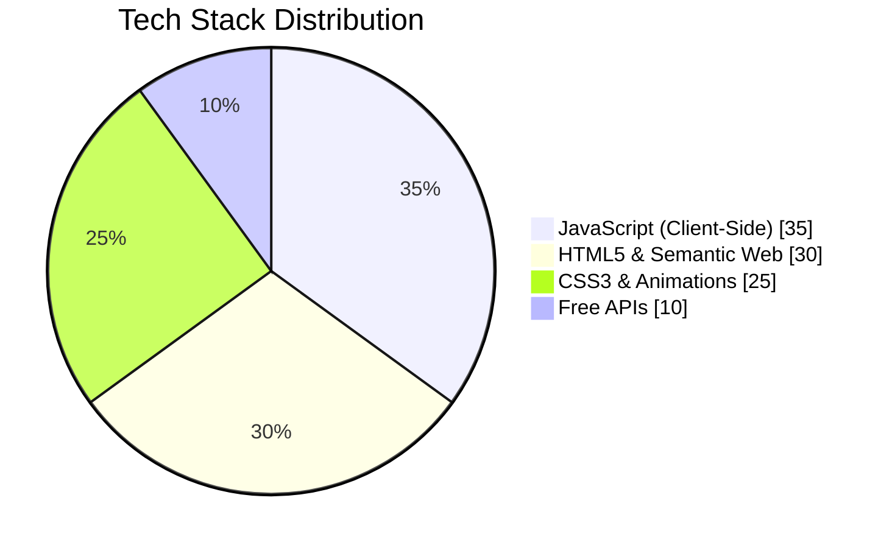
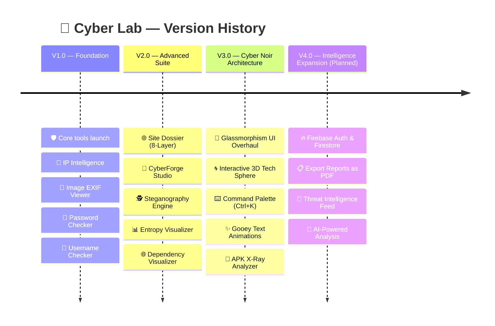
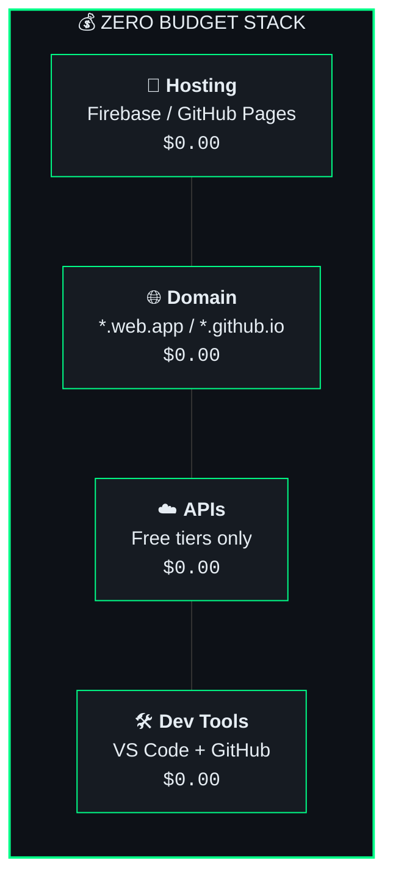
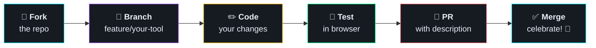
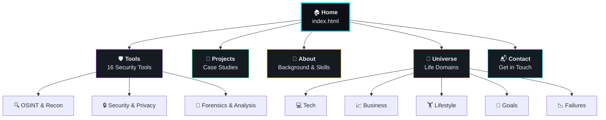

<p align="center">
  
</p>

<pre align="center">
<code>
 ██████╗██╗   ██╗██████╗ ███████╗██████╗     ██╗      █████╗ ██████╗ 
██╔════╝╚██╗ ██╔╝██╔══██╗██╔════╝██╔══██╗    ██║     ██╔══██╗██╔══██╗
██║      ╚████╔╝ ██████╔╝█████╗  ██████╔╝    ██║     ███████║██████╔╝
██║       ╚██╔╝  ██╔══██╗██╔══╝  ██╔══██╗    ██║     ██╔══██║██╔══██╗
╚██████╗   ██║   ██████╔╝███████╗██║  ██║    ███████╗██║  ██║██████╔╝
 ╚═════╝   ╚═╝   ╚═════╝ ╚══════╝╚═╝  ╚═╝    ╚══════╝╚═╝  ╚═╝╚═════╝
        ⚡ Security Tools & Digital Intelligence Portfolio ⚡
</code>
</pre>

<p align="center">
  <strong>🔬 16 Browser-Based Security & OSINT Tools — No Server, No Tracking, No Cost</strong>
</p>

<p align="center">
  <a href="https://rouse.co.in"></a>
  <a href="#-tool-arsenal"></a>
  <a href="#-zero-budget-infrastructure"></a>
</p>

<p align="center">
  
  
  
  
  
</p>

---

## 🧬 What Is This?

> **A weaponized portfolio of 16 client-side security & intelligence tools** — built with zero backend, zero tracking, and zero cost. Every tool runs 100% in your browser. Your data never leaves your machine.

Built by [**Aswini Behera**](https://rouse.co.in/about.html) — a multi-disciplinary builder working across **Cyber Intelligence**, **Full-Stack Architecture**, and **Product Strategy**.

<table>
<tr>
<td width="33%" align="center">

**🛡️ Cyber OSINT**
<br/>
Client-side zero-knowledge security tools, EXIF scrubbers, IP threat scorers & breach calculators

</td>
<td width="33%" align="center">

**💻 Systems & Full-Stack**
<br/>
Scalable web apps, serverless microservices, real-time pipelines & modern responsive UI

</td>
<td width="33%" align="center">

**🧭 Product & Strategy**
<br/>
Zero-budget infrastructure, user-centric workflows & privacy-first product design

</td>
</tr>
</table>

---

## 🔥 Tool Arsenal

> **16 production-ready security tools** — all running client-side with zero-knowledge architecture.

| | Tool | Description | Category |
|:---:|:---|:---|:---:|
| 🔐 | **CyberForge Studio** `V3 NEW` | Multi-format payload encoder, JWT inspector, ROT13 cipher & Web Crypto hashing | `Security` |
| 🌐 | **Site Dossier** `V3.0` | Full 8-Layer Domain Intelligence: DNS, Infra, Supply Chain Graph & Risk Scoring | `OSINT` |
| 👤 | **Imposter Scanner** | Hunt down usernames across 50+ social platforms to find hidden profiles | `OSINT` |
| 📧 | **Email Intelligence** | Analyze email format, domain MX records, and Gravatar presence | `OSINT` |
| 📍 | **IP Intelligence** | Geolocation, ISP data, threat scoring & network analysis for any IP | `OSINT` |
| 🔎 | **DNS & WHOIS** | Lookup A, MX, NS records and domain registration details | `OSINT` |
| 🔍 | **Public Search Dorks** | Generate advanced legal Google Dorks for OSINT research | `OSINT` |
| 🚨 | **Breach Checker** | Check if passwords have been exposed using k-Anonymous hashing (safe) | `Security` |
| 📸 | **Image EXIF Viewer** | Extract hidden metadata, GPS coordinates & device info from images | `Forensics` |
| 📄 | **PDF Utilities** | Analyze, render, and extract text from PDFs entirely in the browser | `Forensics` |
| 🖥️ | **Browser Fingerprint** | Analyze your browser's unique fingerprint and tracking potential | `Security` |
| 🕵️ | **Steganography** | Hide secret messages inside images or extract hidden data | `Forensics` |
| 📊 | **Entropy Visualizer** `NEW` | Visualize Shannon entropy and randomness patterns in any file | `Forensics` |
| 🌐 | **Dependency Visualizer** `NEW` | Map external domains, CDNs, and scripts embedded in any webpage | `Security` |
| 🔑 | **Password Analysis** | Entropy calculation, structure masking & realistic crack-time estimation | `Security` |
| 📱 | **APK X-Ray** `NEW` | Extract backend API URLs, secrets & endpoints from Android APK files | `Forensics` |

---

## 🏗️ System Architecture

> How the zero-server, privacy-first architecture works:



---

## 🗂️ Project Structure



---

## 🔄 User Flow — How Tools Work

> Every tool follows the same privacy-first pattern:

```mermaid
sequenceDiagram
    actor User as 👤 User
    participant Browser as 🌐 Browser
    participant Tool as 🛡️ Tool Engine
    participant API as ☁️ Free API

    User->>Browser: Opens Security Tool
    Browser->>Tool: Initialize (100% Client-Side)
    
    User->>Tool: Inputs Data (IP, Email, File...)
    
    rect rgb(13, 17, 23)
        Note over Tool: 🔒 LOCAL PROCESSING ZONE
        Tool->>Tool: Analyze & Process Locally
        Tool->>Tool: Apply Privacy Filters
    end

    alt 📡 Needs External Data
        Tool->>API: Anonymized API Request
        API-->>Tool: JSON Response
        Note over Tool,API: Only metadata sent — never raw user data
    else 🏠 Fully Local
        Note over Tool: Complete analysis without any network call
    end

    Tool-->>Browser: Render Intelligence Report
    Browser-->>User: Display Results with Visualizations
    
    Note over User,API: 🔐 Zero data stored · No cookies · No tracking · No server logs
```



---

## 🧬 Technology DNA



<table>
<tr>
<td width="50%">

### 🎨 Frontend Stack
| Technology | Purpose |
|:---|:---|
| HTML5 Semantic | Structure & SEO |
| CSS3 + Glassmorphism | Visual design system |
| Vanilla JavaScript | Tool logic & interactivity |
| Inter + Space Grotesk | Typography (Google Fonts) |
| Lucide Icons | Icon library |
| CSS Animations | Gooey text, beam effects, 3D sphere |

</td>
<td width="50%">

### ☁️ APIs & Services (All Free)
| Service | Usage |
|:---|:---|
| ipapi.co | IP geolocation (1K/day) |
| Have I Been Pwned | Breach checking (k-Anonymous) |
| DNS-over-HTTPS | DNS record lookup |
| Gravatar | Email avatar detection |
| exif-js | Client-side EXIF extraction |
| Firebase Hosting | SSL + CDN deployment |

</td>
</tr>
</table>

---

## 🗺️ Project Evolution



---

## 🚀 Quick Start

```bash
# 1. Clone the repository
git clone https://github.com/Ab-aswini/Aswini--mini-security-tool-portfolio.git

# 2. Navigate to the project
cd Aswini--mini-security-tool-portfolio

# 3. Open in browser (no build step needed!)
# Simply open index.html in your browser, or use a local server:

# Option A: Python
python -m http.server 8080

# Option B: Node.js
npx serve .

# Option C: VS Code
# Install "Live Server" extension → Right-click index.html → "Open with Live Server"
```

> **💡 That's it!** No `npm install`, no build process, no dependencies to manage. Pure static files.

---

## 💰 Zero Budget Infrastructure

> **Total operational cost: `$0.00/month`** — Here's how:



<details>
<summary><b>📋 Detailed Cost Breakdown (Click to expand)</b></summary>
<br/>

| Resource | Provider | Free Tier | Cost |
|:---|:---|:---|:---:|
| **Hosting** | Firebase Hosting (Spark Plan) | SSL, CDN, Custom Domains | `$0` |
| **Hosting (Backup)** | GitHub Pages | Unlimited for public repos | `$0` |
| **Domain** | `*.web.app` / `*.github.io` | Included with hosting | `$0` |
| **IP Geolocation** | ipapi.co | 1,000 requests/day | `$0` |
| **EXIF Extraction** | exif-js (client-side) | Unlimited (open source) | `$0` |
| **Icons** | Lucide | Unlimited (open source CDN) | `$0` |
| **Fonts** | Google Fonts | Unlimited | `$0` |
| **Code Editor** | VS Code | Full featured | `$0` |
| **Version Control** | GitHub | Free private repos | `$0` |
| **Design Assets** | Unsplash | Free stock photos | `$0` |
| | | **Monthly Total** | **`$0.00`** |

</details>

<details>
<summary><b>🔮 Future Expansion (Still $0)</b></summary>
<br/>

| Feature | Provider | Free Tier |
|:---|:---|:---|
| Database | Firebase Firestore | 50K reads/day, 20K writes/day |
| Authentication | Firebase Auth | Free for email/social login |
| Cloud Functions | Firebase Functions | 125K invocations/month |
| File Storage | Firebase Storage | 5 GB storage |

</details>

---

## 🤝 Contributing

Contributions are welcome! Here's the workflow:



**Guidelines:**
- 🔒 All tools must remain **100% client-side** — no backend dependencies
- 🎨 Follow the existing **Cyber Noir** design language
- 📱 Ensure **responsive design** for mobile & desktop
- 🧹 Keep code clean — no external CSS/JS frameworks

---

## 🏛️ Pages & Navigation



---

## 📊 Repository Stats

<p align="center">
  
</p>

---

<p align="center">

### ⭐ Star this repo if you find it useful!

</p>

<pre align="center">
<code>
┌──────────────────────────────────────────────────────┐
│                                                      │
│   Built with ❤️ by Aswini Behera                     │
│                                                      │
│   🌐 rouse.co.in  ·  🛡️ Zero Knowledge  ·  💰 $0   │
│                                                      │
│   "Explore fast, build fast, break things,           │
│    learn, and rebuild better."                       │
│                                                      │
└──────────────────────────────────────────────────────┘
</code>
</pre>

<p align="center">
  <sub>🔒 100% Client-Side · No Server · No Tracking · No Cost · Open Source</sub>
</p>
