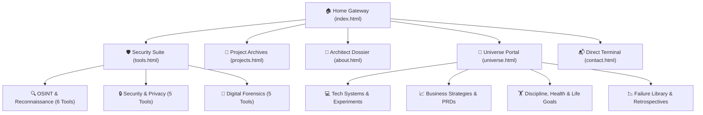
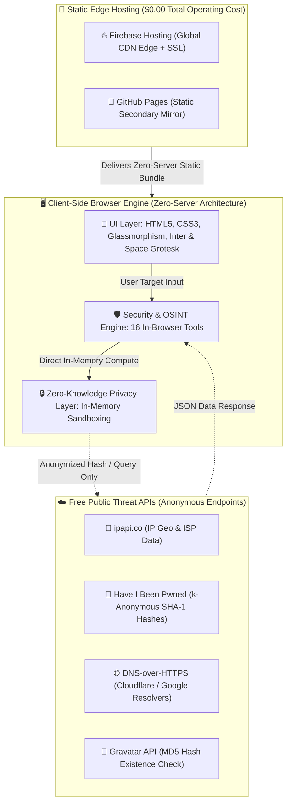
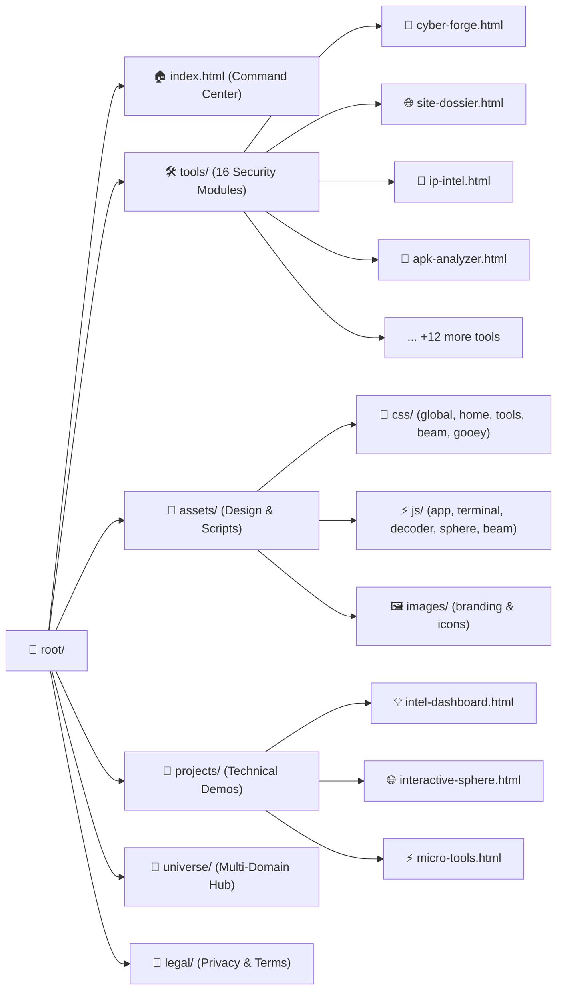
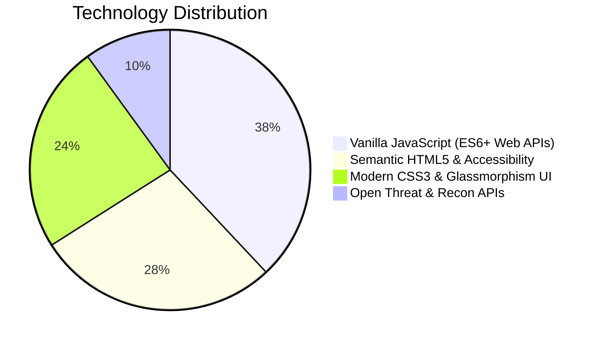
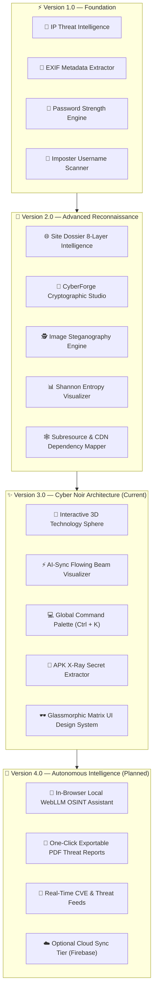
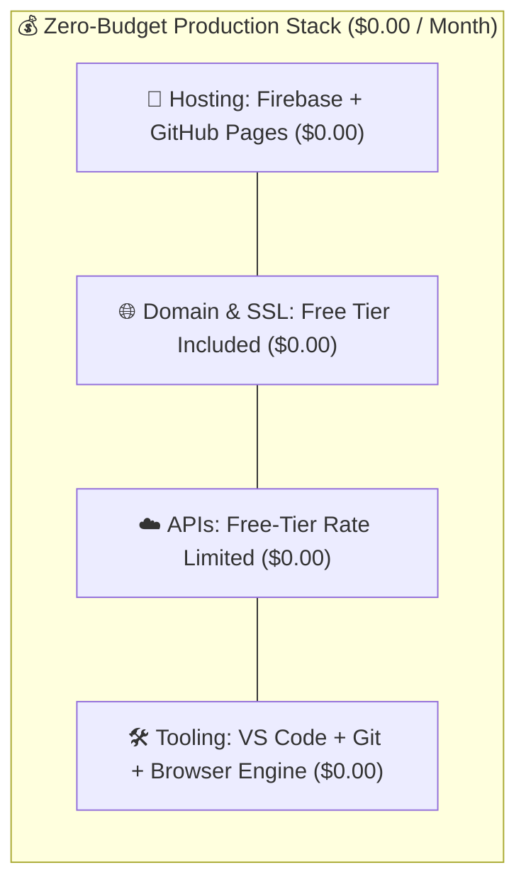
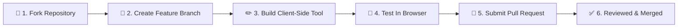

<p align="center">
  
</p>

<pre align="center">
<code>
  ██████╗██╗   ██╗██████╗ ███████╗██████╗     ██╗      █████╗ ██████╗ 
 ██╔════╝╚██╗ ██╔╝██╔══██╗██╔════╝██╔══██╗    ██║     ██╔══██╗██╔══██╗
 ██║      ╚████╔╝ ██████╔╝█████╗  ██████╔╝    ██║     ███████║██████╔╝
 ██║       ╚██╔╝  ██╔══██╗██╔══╝  ██╔══██╗    ██║     ██╔══██║██╔══██╗
 ╚██████╗   ██║   ██████╔╝███████╗██║  ██║    ███████╗██║  ██║██████╔╝
  ╚═════╝   ╚═╝   ╚═════╝ ╚══════╝╚═╝  ╚═╝    ╚══════╝╚═╝  ╚═╝╚═════╝ 
        ⚡ High-Performance Browser-Based Security & OSINT Suite ⚡
</code>
</pre>

<p align="center">
  <strong>🔬 100% Client-Side Privacy-First Architecture — Zero Servers • Zero Tracking • Zero Cost ($0.00)</strong>
</p>

<p align="center">
  <a href="https://rouse.co.in"></a>
  <a href="#-tool-arsenal-16-active-modules"></a>
  <a href="#-zero-budget-infrastructure"></a>
</p>

<p align="center">
  
  
  
  
  
  
</p>

<p align="center">
  <a href="#-quick-navigation"><strong>Quick Navigation</strong></a> •
  <a href="#-mission--architect-overview"><strong>Overview</strong></a> •
  <a href="#-tool-arsenal-16-active-modules"><strong>Tools Matrix</strong></a> •
  <a href="#-system-architecture"><strong>Architecture</strong></a> •
  <a href="#-user-execution-lifecycle"><strong>User Flow</strong></a> •
  <a href="#-technology-dna"><strong>Tech Stack</strong></a> •
  <a href="#-project-evolution--roadmap"><strong>Roadmap</strong></a> •
  <a href="#-zero-budget-infrastructure"><strong>Zero Budget</strong></a> •
  <a href="#-quick-start"><strong>Quick Start</strong></a>
</p>

---

## 🧭 Quick Navigation



---

## 🧬 Mission & Architect Overview

> **A weaponized portfolio of 16 client-side digital intelligence and cybersecurity utilities** designed for investigators, security researchers, and developers. Built with strict **zero-knowledge processing**: every calculation, hash, visual extraction, and pattern match happens inside the user's browser runtime.

Architected by [**Aswini Behera**](https://rouse.co.in/about.html) — a multi-disciplinary builder working across **Cyber Intelligence**, **Full-Stack Systems**, and **Autonomous Workflows**.

<table>
<tr>
<td width="33%" align="center">

### 🛡️ Cyber OSINT
*Client-side zero-knowledge security tools, EXIF metadata scrubbers, IP threat scorers, and data breach calculators.*

</td>
<td width="33%" align="center">

### 💻 Systems & Full-Stack
*Scalable web applications, serverless microservices, real-time data pipelines, and cyber noir UI.*

</td>
<td width="33%" align="center">

### 🧭 Product & Strategy
*Sustainable $0-budget infrastructure, user-centric threat modeling, and privacy-first engineering.*

</td>
</tr>
</table>

---

## 🔥 Tool Arsenal (16 Active Modules)

Every tool is fully functional, isolated, and accessible directly from the [`/tools`](https://rouse.co.in/tools.html) dashboard.

### 🔍 Category 1: OSINT & Reconnaissance Matrix

| Module | Access | Purpose & Features | Data Scope |
|:---|:---:|:---|:---:|
| 🌐 **Site Dossier** `v3.0` | [`site-dossier.html`](tools/site-dossier.html) | Full 8-layer domain intelligence: DNS trees, ASN routing, supply chain scripts, SSL health, and aggregated threat scoring. | Domain / URL |
| 👤 **Imposter Scanner** | [`dashboard.html`](tools/dashboard.html) | Direct-discovery social hunter scanning 50+ platforms simultaneously for hijacked or duplicate profiles. | Username |
| 📍 **IP Intelligence** | [`ip-intel.html`](tools/ip-intel.html) | Comprehensive geolocation mapping, ASN routing classification, ISP lookup, and threat rating. | IPv4 / IPv6 |
| 📧 **Email Intelligence** | [`email-intel.html`](tools/email-intel.html) | Deep email syntax verification, domain MX record validation, and MD5/SHA256 Gravatar identity lookups. | Email |
| 🔎 **DNS & WHOIS Hub** | [`dns-whois.html`](tools/dns-whois.html) | Multi-record query suite (A, AAAA, MX, TXT, NS, SOA, CNAME) via DNS-over-HTTPS with zero ISP sniffing. | Domain |
| 🔍 **Public Search Dorks** | [`public-search.html`](tools/public-search.html) | Advanced automated legal Google Dork generator for cloud storage exposures, admin panels, and leaked logs. | Keyword / Target |

### 🔒 Category 2: Security & Cryptography Engine

| Module | Access | Purpose & Features | Security Model |
|:---|:---:|:---|:---:|
| 🔐 **CyberForge Studio** `v3.0` | [`cyber-forge.html`](tools/cyber-forge.html) | Multi-format encoding suite (Base64, Hex, URL, Binary), JWT inspector/decoder, ROT ciphers, and WebCrypto SHA/MD5 hashing. | 100% In-Memory |
| 🚨 **Breach Checker** | [`breach-checker.html`](tools/breach-checker.html) | Secure compromised password verification using SHA-1 prefix k-anonymity (plain password never leaves device). | k-Anonymous |
| 🔑 **Password Analysis** | [`password-strength.html`](tools/password-strength.html) | Shannon entropy measurement, character-space collision analysis, mask identification, and realistic brute-force crack timelines. | Local Compute |
| 🖥️ **Browser Fingerprint** | [`browser-fingerprint.html`](tools/browser-fingerprint.html) | In-depth tracker evaluation: Canvas hash, WebGL vendor, AudioContext signature, screen geometry, and entropy score. | Local Hardware |
| 🕸️ **Dependency Visualizer** | [`subresource-scanner.html`](tools/subresource-scanner.html) | Subresource and CDN supply chain security mapper highlighting third-party script risks and tracker inclusions. | DOM Extraction |

### 🔬 Category 3: Digital Forensics & Deep Analysis

| Module | Access | Purpose & Features | Runtime |
|:---|:---:|:---|:---:|
| 📸 **Image EXIF Viewer** | [`image-exif.html`](tools/image-exif.html) | Parses embedded TIFF/EXIF tags, extracts camera hardware profiles, lens focal settings, and GPS geolocation coordinates. | Client Binary Parser |
| 📱 **APK X-Ray Analyzer** `NEW` | [`apk-analyzer.html`](tools/apk-analyzer.html) | Client-side ZIP-decompilation of Android APKs to hunt hardcoded API keys, OAuth tokens, and backend REST endpoints. | Client-Side WASM/JS |
| 📊 **Entropy Visualizer** `NEW` | [`entropy-visualizer.html`](tools/entropy-visualizer.html) | Byte-level Shannon entropy distribution graph to immediately distinguish compressed, encrypted, and obfuscated code blocks. | Byte Chunk Array |
| 🕵️ **Steganography Studio** | [`steganography.html`](tools/steganography.html) | Least Significant Bit (LSB) steganographic encoder and decoder for hiding AES-encrypted secret payloads inside image pixels. | Canvas Pixel Buffer |
| 📄 **PDF Forensic Tools** | [`pdf-tools.html`](tools/pdf-tools.html) | In-browser PDF stream inspection, metadata extraction, object tree analysis, and clean text dissociation. | Local PDF.js Engine |
| 🏛️ **Lab Architecture** | [`lab-architecture.html`](tools/lab-architecture.html) | Deep technical architecture documentation, threat hunting workflows, and system whitepapers. | Reference Hub |

---

## 🏗️ System Architecture



---

## 🔄 User Execution Lifecycle

```mermaid
sequenceDiagram
    autonumber
    actor User as 👤 Security Analyst / User
    participant Browser as 🌐 Client Browser Runtime
    participant Engine as 🛡️ Local Tool Engine
    participant API as ☁️ Threat Intelligence API

    User->>Browser: Select Tool & Provide Target (IP, Domain, File, Hash)
    Browser->>Engine: Mount Tool Module (100% Client-Side JS)
    
    rect rgb(13, 17, 23)
        Note over Engine: 🔒 ZERO-KNOWLEDGE EXECUTION ZONE
        Engine->>Engine: Parse Input, Calculate Hashes & Run Client-Side Logic
        Engine->>Engine: Strip Personally Identifiable Information
    end

    opt Remote Threat Lookup Needed
        Engine->>API: Dispatch Anonymized Request (e.g. SHA-1 5-char prefix)
        API-->>Engine: Return Status Code & Public Intelligence Payload
    end

    Engine-->>Browser: Compile Interactive Dossier & Graph Visualizations
    Browser-->>User: Render Results (No cookies, No database, No server logs)
```



---

## 🗂️ Project Directory Tree



---

## 🧬 Technology DNA



<table>
<tr>
<td width="50%">

### 🎨 Frontend & Design System
* **HTML5 Semantic Core**: Zero bloat, SEO optimized, full mobile responsiveness.
* **Vanilla CSS3**: Glassmorphism token system, dynamic dark/light themes.
* **Cyber Visuals**: Flowing SVG AI beams, gooey text animations, 3D interactive tag sphere.
* **Typography**: Space Grotesk (HUD Headings) + Inter (Body).
* **Icons**: Feather/Lucide vector icon suite.

</td>
<td width="50%">

### 🛡️ Cryptography & APIs ($0 Tier)
* **WebCrypto API**: Native browser cryptographic hashing (SHA-256, SHA-512).
* **k-Anonymity Hashing**: 5-character prefix matching for leak checks.
* **Cloudflare / Google DoH**: DNS-over-HTTPS JSON resolvers.
* **ipapi.co**: IP Geolocation & ASN classification (1,000 req/day).
* **exif-js & PDF.js**: Client-side binary and document parsing.

</td>
</tr>
</table>

---

## 🗺️ Project Evolution & Roadmap



---

## 💰 Zero Budget Infrastructure



<details>
<summary><strong>📋 Detailed Cost Breakdown Table (Click to Expand)</strong></summary>
<br/>

| Infrastructure Layer | Service Provider | Plan Quota Included | Monthly Cost |
|:---|:---|:---|:---:|
| **Primary CDN Hosting** | Firebase Hosting | Spark Plan (Global CDN, SSL, Custom Domains) | `$0.00` |
| **Mirror Hosting** | GitHub Pages | Unlimited bandwidth for public repositories | `$0.00` |
| **Domain & DNS** | `web.app` / `github.io` / Cloudflare DNS | Free SSL Certificates & Anycast DNS | `$0.00` |
| **IP Intelligence** | ipapi.co | 1,000 queries / 24 hours | `$0.00` |
| **Breach Detection** | Have I Been Pwned Pwned Passwords | Unlimited k-anonymous SHA-1 prefix searches | `$0.00` |
| **DNS Resolution** | Cloudflare / Google DoH | Unlimited JSON DNS-over-HTTPS queries | `$0.00` |
| **Image & Binary Parsing** | Native WebAssembly & JavaScript | 100% Client-side compute | `$0.00` |
| **Code Editor & Versioning** | VS Code & GitHub | Free open-source development environment | `$0.00` |
| | | **TOTAL OPERATING EXPENSE** | **`$0.00`** |

</details>

---

## 🚀 Quick Start & Local Development

No complex setup, no `npm install` dependency hell, and no build configuration required.

```bash
# 1. Clone the repository
git clone https://github.com/Ab-aswini/Aswini--mini-security-tool-portfolio.git

# 2. Enter the project directory
cd Aswini--mini-security-tool-portfolio

# 3. Launch a local web server (pick your preference):

# Option A — Python 3
python -m http.server 8080

# Option B — Node.js npx
npx serve .

# Option C — VS Code Live Server
# Right click on index.html -> Click 'Open with Live Server'
```

Open `http://localhost:8080` in any modern browser.

---

## 🤝 Contribution Pipeline



**Development Guidelines:**
1. **Zero-Server Rule**: All new tools must execute entirely client-side using JavaScript or WebAssembly.
2. **Zero-Tracking Rule**: Do not introduce analytics scripts, session cookies, or telemetry trackers.
3. **Design Standard**: Match the cyber noir aesthetics using standard CSS variables from `assets/css/global.css`.

---

## 📜 License & Acknowledgments

This project is open-source software licensed under the **MIT License**.

<pre align="center">
<code>
┌────────────────────────────────────────────────────────────────────────┐
│                                                                        │
│   Architected with passion & precision by Aswini Behera                │
│                                                                        │
│   🌐 rouse.co.in   •   🛡️ Zero Knowledge   •   💰 $0.00 Budget         │
│                                                                        │
│   "Explore fast, build fast, break things, learn, and rebuild better." │
│                                                                        │
└────────────────────────────────────────────────────────────────────────┘
</code>
</pre>

<p align="center">
  <sub>🔒 Built for privacy • Made for researchers • 100% Client-Side Architecture</sub>
</p>
